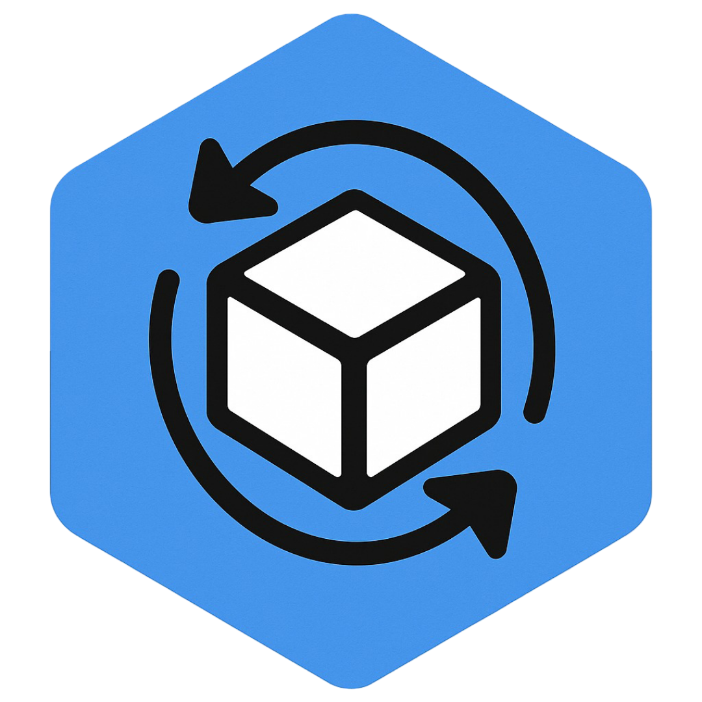

<!-- SharedVolume - Kubernetes Data Sharing Simplified -->
<!-- This is the main README.md file for the SharedVolume documentation -->

  
  <h1 style="border-bottom: none; margin-top: 20px; color: var(--themeColor, #6366f1);">Kubernetes Data Sharing Simplified</h1>
  

    <strong>Connect, Scale</strong> - Effortless data sharing at Kubernetes scale.
  

  

    <strong>SharedVolume</strong> is a powerful Kubernetes operator that revolutionizes how you share data between pods and workloads. Effortlessly sync content from Git repositories, S3 buckets, HTTP sources, and more with just a few lines of YAML.
  

  

    <a href="getting-started/installation.md" style="display: inline-block; padding: 12px 24px; background-color: #f8fafc; color: #1e293b; text-decoration: none; font-weight: bold; border-radius: 6px; border: 2px solid #4f46e5; box-shadow: 0 2px 4px rgba(0,0,0,0.1); transition: all 0.2s;">🚀 Get Started</a>
    <a href="overview/what-is-shared-volume.md" style="display: inline-block; padding: 12px 24px; background-color: #f8fafc; color: #1e293b; text-decoration: none; font-weight: bold; border-radius: 6px; border: 2px solid #4f46e5; box-shadow: 0 2px 4px rgba(0,0,0,0.1); transition: all 0.2s;">📘 Learn More</a>
    <a href="https://github.com/sharedvolume/shared-volume" style="display: inline-block; padding: 12px 24px; background-color: #f8fafc; color: #1e293b; text-decoration: none; font-weight: bold; border-radius: 6px; border: 2px solid #4f46e5; box-shadow: 0 2px 4px rgba(0,0,0,0.1); transition: all 0.2s;">⭐ Star on GitHub</a>
  

## ✨ Why Choose SharedVolume?

  

    
🔄

    <h3 style="margin-top: 0; color: var(--themeColor, #6366f1);">Multi-Source Sync</h3>
    
Automatically sync data from <strong>Git repositories</strong>, <strong>S3 buckets</strong>, <strong>HTTP endpoints</strong>, and <strong>SSH sources</strong>. Keep your data fresh across all workloads without manual intervention.

  

  
  

    
📦

    <h3 style="margin-top: 0; color: var(--themeColor, #6366f1);">Simple Integration</h3>
    
Mount shared volumes into any pod using <strong>simple annotations</strong> - no complex volume configurations needed. Get started in minutes, not hours, with our intuitive approach.

  

  
  

    
💾 

    <h3 style="margin-top: 0; color: var(--themeColor, #6366f1);">Efficient Storage Usage</h3>
    
Uses the same storage at the background, keeping only one copy through shared storage approach - reducing storage costs and improving efficiency.

  

  
  

    
🌐

    <h3 style="margin-top: 0; color: var(--themeColor, #6366f1);">Cross-Namespace Volume Sharing</h3>
    
Enables volume sharing across namespace pods using ClusterSharedVolume, breaking traditional namespace boundaries for storage access.

  

## 🎯 Perfect Use Cases

<table style="width: 100%; border-collapse: collapse; margin: 30px 0;">
  <tr>
    <td style="width: 50%; padding: 15px; vertical-align: top; border: 1px solid #eaeaea; background-color: #fafafa;">
      

        
⚙️

        

          <h4 style="margin-top: 0; color: var(--themeColor, #6366f1);">Configuration Management</h4>
          
Share config files, secrets, and settings across multiple services

        

      

    </td>
    <td style="width: 50%; padding: 15px; vertical-align: top; border: 1px solid #eaeaea; background-color: #fafafa;">
      

        
🌐

        

          <h4 style="margin-top: 0; color: var(--themeColor, #6366f1);">Static Asset Distribution</h4>
          
Serve shared assets, documentation, and resources from CDN or Git

        

      

    </td>
  </tr>
  <tr>
    <td style="width: 50%; padding: 15px; vertical-align: top; border: 1px solid #eaeaea; background-color: #fafafa;">
      

        
🔄

        

          <h4 style="margin-top: 0; color: var(--themeColor, #6366f1);">CI/CD Pipelines</h4>
          
Pass build artifacts, test results, and deployments between pipeline stages

        

      

    </td>
    <td style="width: 50%; padding: 15px; vertical-align: top; border: 1px solid #eaeaea; background-color: #fafafa;">
      

        
⚡

        

          <h4 style="margin-top: 0; color: var(--themeColor, #6366f1);">Multi-Stage Workflows</h4>
          
Share data and results between different processing steps and microservices

        

      

    </td>
  </tr>
  <tr>
    <td style="width: 50%; padding: 15px; vertical-align: top; border: 1px solid #eaeaea; background-color: #fafafa;">
      

        
📊

        

          <h4 style="margin-top: 0; color: var(--themeColor, #6366f1);">Data Processing</h4>
          
Distribute datasets, models, and processing results across compute workloads

        

      

    </td>
    <td style="width: 50%; padding: 15px; vertical-align: top; border: 1px solid #eaeaea; background-color: #fafafa;">
      

        
🔧

        

          <h4 style="margin-top: 0; color: var(--themeColor, #6366f1);">Development Tools</h4>
          
Share development environments, tools, and resources across teams

        

      

    </td>
  </tr>
</table>

## 🚀 Quick Start

  
💡 Get up and running in under 5 minutes!

  

    Ready to get started with SharedVolume? Our comprehensive quick start guide will walk you through installation, creating your first SharedVolume, and mounting it in your pods with simple annotations.
  

  <a href="getting-started/quick-start.md" style="display: inline-block; padding: 12px 24px; background-color: #f8fafc; color: #1e293b; text-decoration: none; font-weight: bold; border-radius: 6px; border: 2px solid #4f46e5; box-shadow: 0 2px 4px rgba(0,0,0,0.1); transition: all 0.2s;">📖 Follow our Quick Start Guide</a>

  Step-by-step instructions to deploy SharedVolume in your cluster and start sharing data between your workloads.

---

## 🤝 Community & Support

### **�‍💻 Project Creator & Maintainer**

  

    
🚀

    

      <h4 style="margin: 0 0 8px 0; color: #0369a1;">Bilgehan Nal</h4>
      
Project Creator & Main Contributor

      

        <a href="https://bilgehannal.com" style="color: #0369a1; font-weight: 500; text-decoration: none;">🌐 bilgehannal.com</a>
      

    

  

  

    "SharedVolume was born from the need to simplify data sharing in Kubernetes environments. Thank you for being part of this journey!"
  

### **�💬 Get Help & Connect**
| Resource | Description |
|----------|-------------|
| 🏠 **[Organization Page](https://github.com/sharedvolume)** | Github organization for SharedVolume |
| 🐛 **[Issue Tracker](https://github.com/sharedvolume/shared-volume/issues)** | Report bugs, request features, get support |

### **🚀 Stay Updated**
| Resource | Description |
|----------|-------------|
| 🗺️ **[Roadmap](support/roadmap.md)** | See what's coming next in SharedVolume |
| 📢 **[Release Notes](https://github.com/sharedvolume/shared-volume/releases)** | Latest features and improvements |

### **🤝 Contributing**
| Resource | Description |
|----------|-------------|
| 🎯 **[How to Contribute](contributing/how-to-contribute.md)** | Guidelines for contributing code and documentation |
| 🔨 **[Local Development](contributing/local-development.md)** | Set up your development environment |

---

  
  <h2 style="margin-top: 0; color: #1e293b; font-size: 1.8em;">Ready to simplify your Kubernetes data sharing?</h2>
  

    Join the developers who are already using SharedVolume in their projects.
  

  

    <a href="getting-started/installation.md" style="display: inline-block; padding: 12px 24px; background-color: #f8fafc; color: #1e293b; text-decoration: none; font-weight: bold; border-radius: 6px; border: 2px solid #4f46e5; box-shadow: 0 2px 4px rgba(0,0,0,0.1); transition: all 0.2s;">🚀 Get Started Now</a>
    <a href="https://github.com/sharedvolume/shared-volume" style="display: inline-block; padding: 12px 24px; background-color: #f8fafc; color: #1e293b; text-decoration: none; font-weight: bold; border-radius: 6px; border: 2px solid #4f46e5; box-shadow: 0 2px 4px rgba(0,0,0,0.1); transition: all 0.2s;">⭐ Star on GitHub</a>
  

<!-- Custom styles for SharedVolume documentation -->

